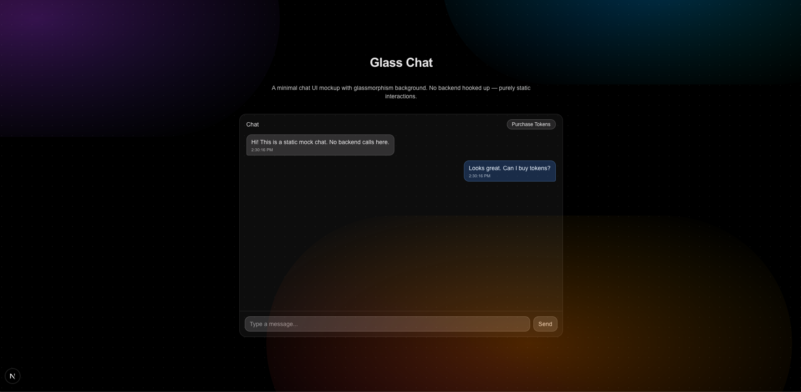

<div align="center">

# Glass Chat

Minimal chat UI mockup with a glassmorphism background. Purely static interactions — no backend.



</div>

## Features

- Glassmorphism background with a subtle animated pattern
- Static chat panel UI to prototype layouts quickly
- App Router structure with `app/` directory

## Tech Stack

- **Framework**: Next.js 15 (App Router)
- **UI**: React 19, Tailwind CSS 4

## Getting Started

### 1) Install dependencies

```bash
npm install
```

### 2) Run the dev server

```bash
npm run dev
```

Then open http://localhost:3000

### 3) Build and run production

```bash
npm run build
npm start
```

## Scripts

- `npm run dev`: Start development server
- `npm run build`: Build for production
- `npm start`: Start production server
- `npm run lint`: Lint the codebase

## Project Structure

```text
.
├─ app/
│  ├─ layout.tsx      # Root layout
│  └─ page.tsx        # Home page (Glass Chat)
├─ components/
│  ├─ BackgroundPattern.tsx
│  └─ ChatPanel.tsx
├─ public/            # Static assets
├─ screenshot.png     # App screenshot used above
└─ README.md
```

## Notes

- The UI is static and intended as a design/UX prototype. Hook up your own data and state management for real chat features.

## Deployment

- Works great on Vercel. After pushing to GitHub, import the repo in Vercel and deploy.
